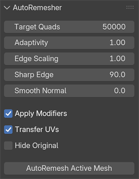

# AutoRemesher Bridge for Blender

A small Blender add-on that runs [AutoRemesher](https://github.com/huxingyi/autoremesher) on the active mesh and imports the result back into Blender as a new object.

It is intentionally thin: Blender exports a temporary OBJ, AutoRemesher processes it, then Blender imports the remeshed OBJ as a copy. The original mesh is left untouched unless you enable **Hide Original**.



## Features

- Remesh the active mesh from Blender
- Set target quad count, adaptivity, edge scaling, sharp edge angle and smooth normal angle
- Import the remeshed result as a new object
- Copy material slots from the source mesh
- Optional UV transfer from the source mesh
- Optional modifier application during export

## Requirements

- Blender 4.2 or newer
- AutoRemesher installed separately

This repository does not include AutoRemesher binaries. Download AutoRemesher from the upstream project:

https://github.com/huxingyi/autoremesher

## Installation

### Option 1: Release ZIP

Download the latest `autoremesher_bridge-*.zip` from the releases page:

https://github.com/adriflex/autoremesher-blender-bridge/releases

Install it from Blender:

```text
Edit > Preferences > Add-ons > Install from Disk
```

Then enable **AutoRemesher Bridge** in Blender preferences.

### Option 2: Blender extensions folder

Copy this folder into your Blender user extensions folder:

```text
Blender/<version>/extensions/user_default/autoremesher_bridge
```

Then enable **AutoRemesher Bridge** in Blender preferences.

## AutoRemesher executable

The add-on needs to know where `autoremesher` is installed.

You can set it in:

```text
Edit > Preferences > Add-ons > AutoRemesher Bridge > AutoRemesher Executable
```

Alternatively, leave the preference empty and use either:

- the `AUTOREMESHER_PATH` environment variable
- an `autoremesher` or `autoremesher.exe` executable available in your PATH

## Usage

1. Select a mesh object.
2. Open the viewport sidebar with `N`.
3. Go to the **AutoRemesher** tab.
4. Set **Target Quads** and any other options.
5. Click **AutoRemesh Active Mesh**.

The result is imported as:

```text
<source object name>_autoremesh
```

## Notes

- The add-on uses OBJ as an exchange format.
- Materials are copied as material slots, not rebuilt from exported material files.
- UV transfer is best-effort and depends on the source and remeshed topology.
- Large meshes can take time. Blender may appear busy while AutoRemesher runs.

## Author

Made by [Adriflex](https://adriflex.github.io/).

## License

This add-on is released under GPL-3.0-or-later.

AutoRemesher is a separate project by huxingyi and is licensed under MIT.
